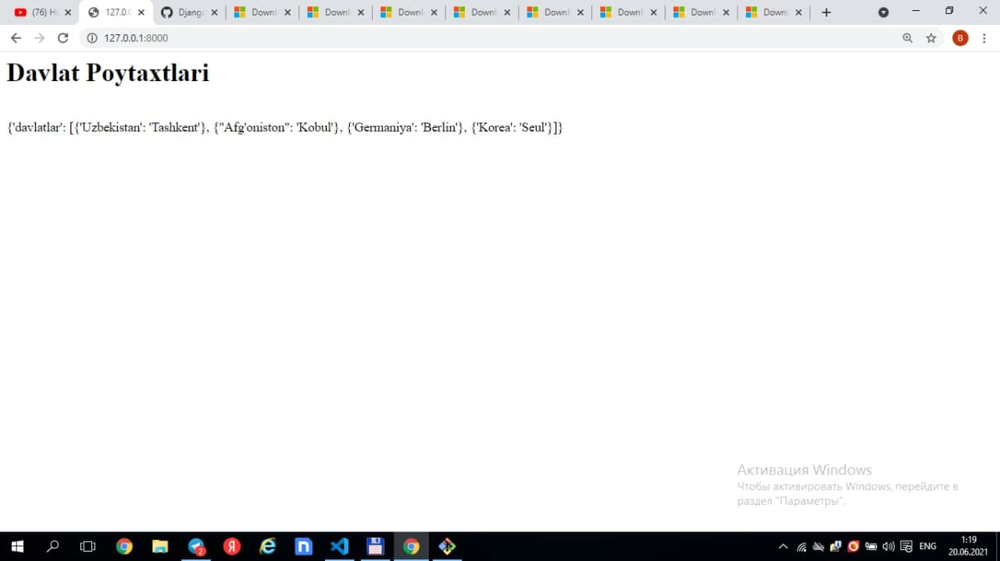
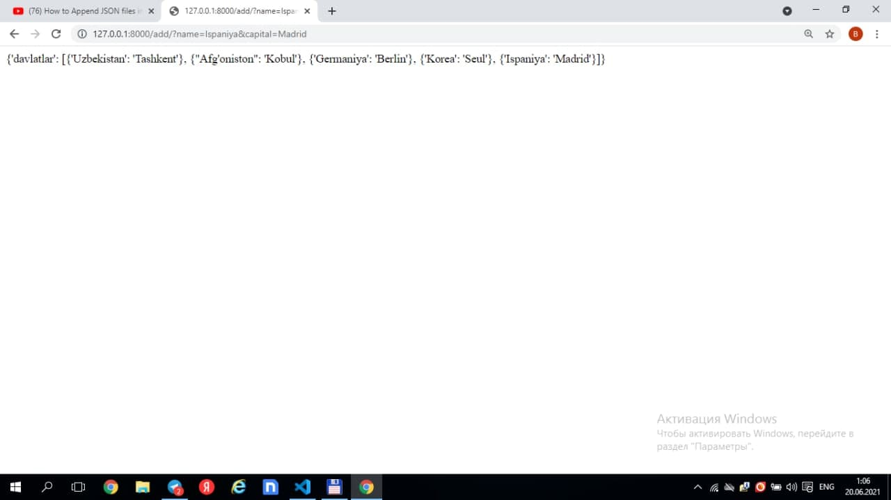
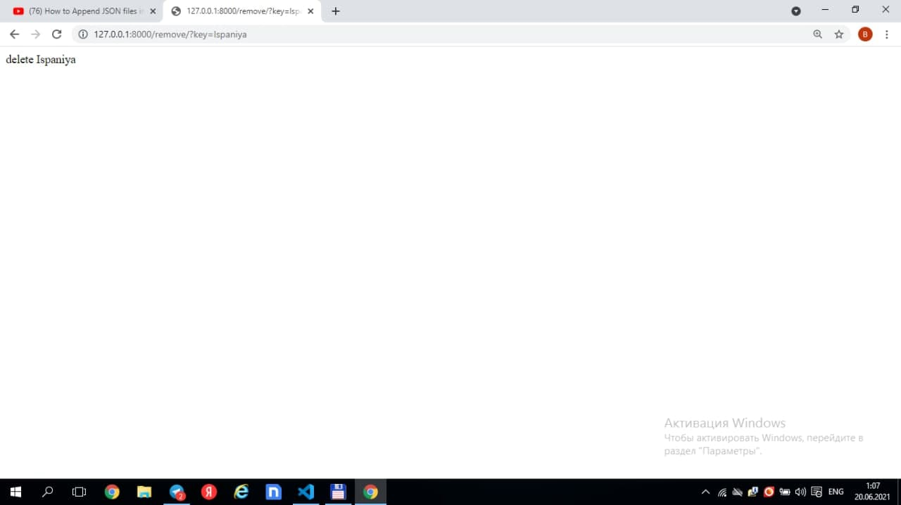

# Django-urls
***
### 1.vertual muhit yaratib olamiz 
    1.1 python -m venv env
    1.2 env\Scsripts\activate
### 2.djangoni o'rnatib olamiz
    2.1 pip install django
### 3.djangoda proyekt yaratib olamiz
    3.1 django-admin startproject config .
### 4.djangoda app ni yaratib olamiz
    4.1 python manage.py startapp todo-app
      
    4.2 ---add---  davlat va poytaxtlarni ko'shish
    
    4.3 ---remove--- davlat va poytaxtlarni o'chirish
    
